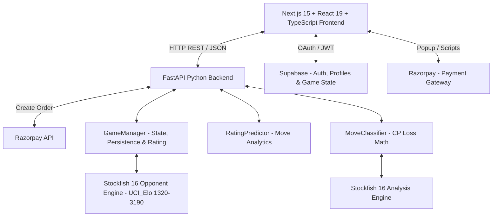
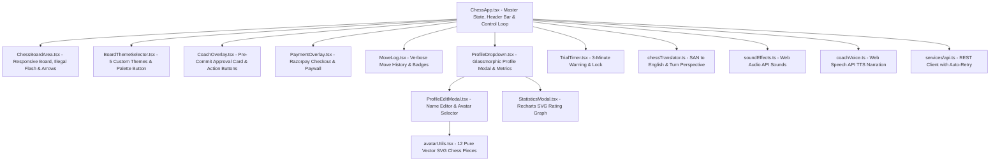
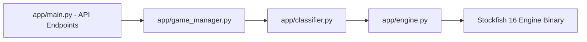
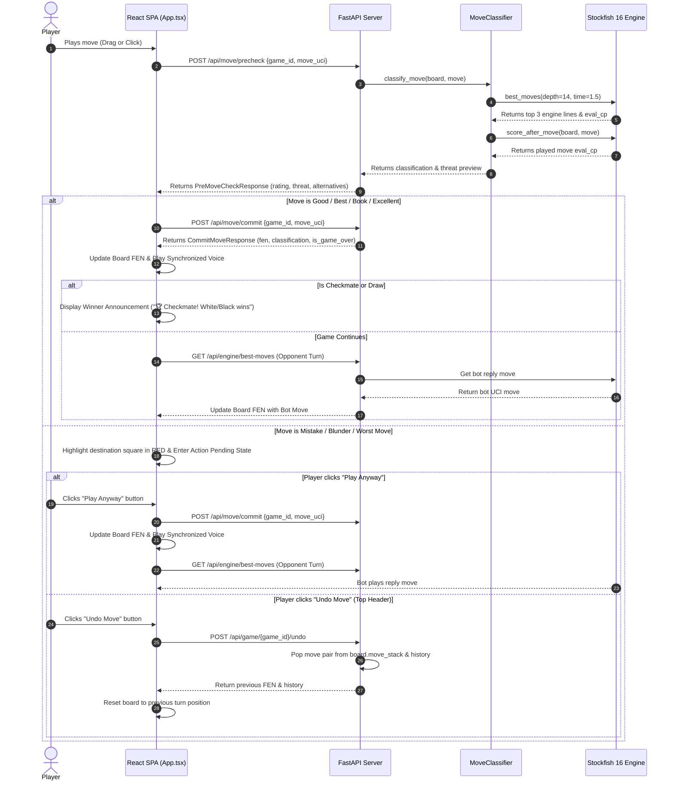
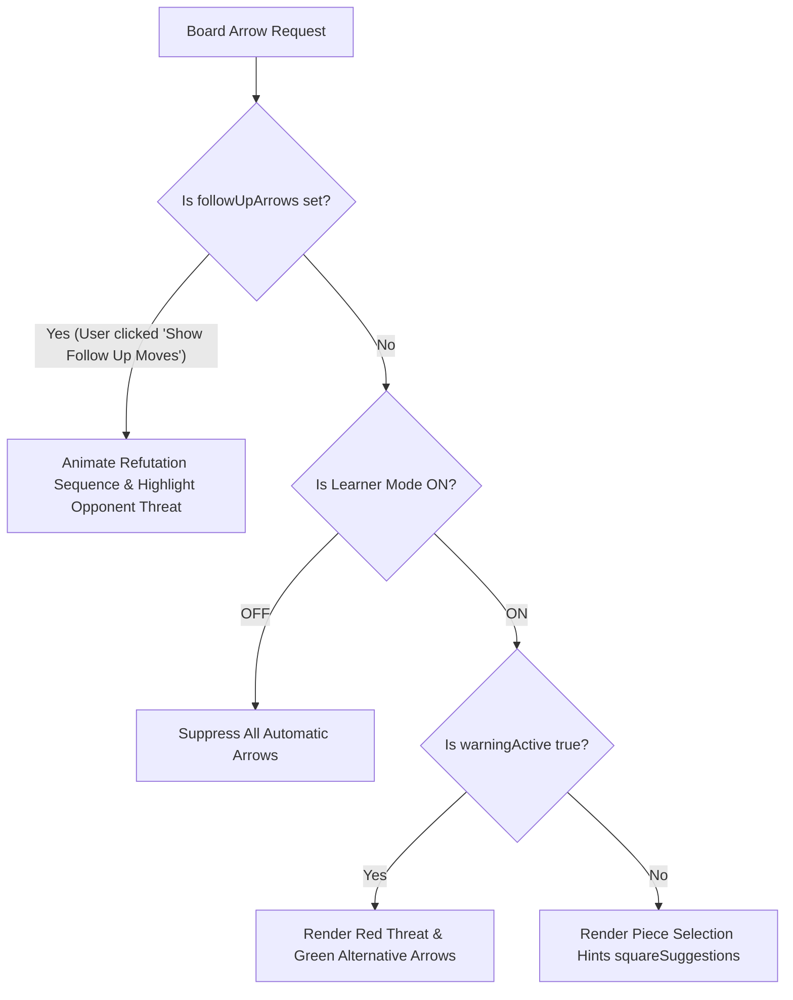
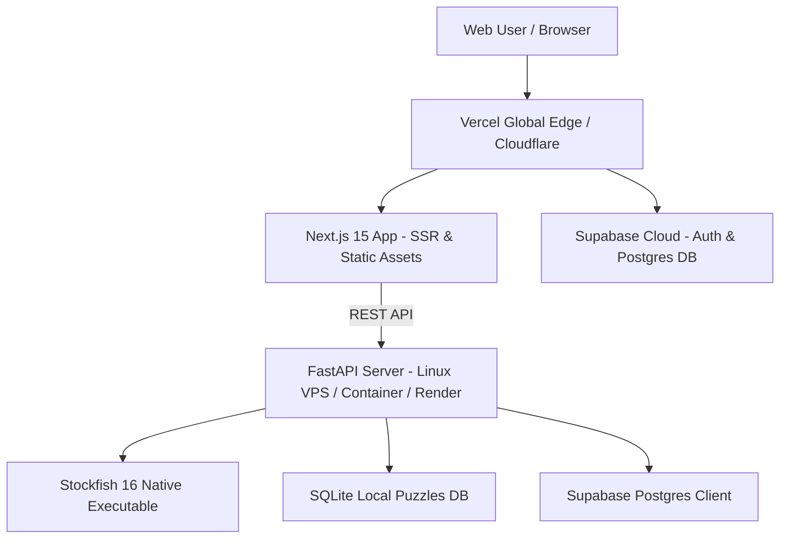

# System Architecture Document

## Project Name: Smart Chess - AI Mistake Coach

---

## 1. High-Level Architecture Overview

**Smart Chess** is structured as a decoupled client-server web application featuring a modern Next.js 15 (React 19) SPA frontend and a high-performance Python FastAPI backend integrated with the Stockfish 16 chess engine and Supabase cloud database.

---

## 2. Component Architecture

### 2.1 Frontend Architecture (Next.js 15 + React 19 + TypeScript)

The frontend is built using Next.js 15 App Router, styled with Tailwind CSS, and powered by `react-chessboard`, `chess.js`, and `recharts`.

- **`ChessApp.tsx`**: Manages master game state (`gameId`, `fen`, `playerColor`, `warningActive`, `history`, `isRobotThinking`, `isConnecting`). Renders the top navigation bar with centralized profile access, side selection, rating slider, learner mode, coach voice, and undo controls.
- **`ProfileDropdown.tsx`**: A dark glassmorphic (`#111`) modal displaying the player's avatar, name, and a 3-column key metrics grid: **Performance Rating**, **Win Rate** (dynamic from finished games), and **Total Games** (with active/finished breakdown). Below the metrics, it lists the top 7 played games with interactive mini `<Chessboard>` thumbnails to click and continue matches. Features a dedicated "View Analytics" action button.
- **`ProfileEditModal.tsx`**: Full-featured profile editor allowing players to update their display name, upload custom photos (auto-compressed on client to base64 JPEG under 256px), or select from 12 vector chess piece avatars.
- **`avatarUtils.tsx`**: Contains 12 pure SVG vector chess piece icons (`wP`, `bP`, `wN`, `bN`, `wB`, `bB`, `wR`, `bR`, `wQ`, `bQ`, `wK`, `bK`). Replaced canvas-drawn Unicode emojis to ensure crisp, glitch-free rendering on Windows and all high-DPI displays.
- **`BoardThemeSelector.tsx`**: Theme palette selector located beside the white rook at bottom-left of the chessboard (`-left-12 bottom-0`). Supports Classic Wood, Midnight Blue, Emerald Green, Coral, and Obsidian with localStorage persistence.
- **`StatisticsModal.tsx`**: Interactive performance modal powered by **Recharts (^3.10.1)**. Features pure vector SVG rendering, responsive auto-fitting (`<ResponsiveContainer>`), interactive hover tooltips, and dynamic win rate and game outcome breakdowns.
- **`AuthForm.tsx`**: Handles Google OAuth and Email/Password authentication via Supabase.
- **`PaymentOverlay.tsx`**: Triggers Razorpay window. On successful payment, the modal auto-closes as the React Context updates `is_premium` globally. Overlays use cinematic heavy background blur (`backdrop-blur-xl bg-black/90`).
- **`ChessBoardArea.tsx`**: Renders the responsive chessboard grid (`85vh`), handles drag-and-drop & click-to-move input, renders legal destination dots, visual engine arrows, orange-red flash on illegal/pinned moves (`illegalFlashSquare`), and solid red square highlights (`badMoveSquare`) on mistakes.
- **`CoachOverlay.tsx`**: Renders the pre-commit approval card over the board with 3 standard buttons: 💡 **Hint Box**, ▶️ **Play Anyway**, and 🛡️ **Show Follow Up Moves**.
- **`coachVoice.ts`**: Web Speech API Text-to-Speech narration layer. Audio lines are 100% synchronized with the committed classification badge in `commitAndFinalize`.
- **`soundEffects.ts`**: Web Audio API synthesizer for classic wooden piece movement/capture sounds (`playMoveSoundForUci()`).
- **`chessTranslator.ts`**: Converts SAN notation (e.g. `Nf3`, `exd5`) into natural English with automatic turn-perspective flipping for opponent reply threats.
- **`useSession.ts`**: Implements multi-tier profile persistence (Supabase Auth user metadata + `public.profiles` table upsert + synchronous `localStorage` caching) ensuring zero profile resets on page refresh.

---

### 2.1b Authentication, Trial & Payments Architecture

The application relies on a combination of Supabase and Razorpay to gate gameplay, utilizing a soft-to-hard paywall model.

1. **3-Minute Free Trial**: Upon starting a game, unauthenticated or non-premium users trigger a local 3-minute countdown. A warning warns them that progress will be lost. Once 3 minutes elapse, the board locks and resets.
2. **Authentication**: Users log in via Google OAuth directly from the frontend (`AuthForm.tsx`). Supabase manages the session via JWTs and creates a corresponding record in the `profiles` table.
3. **Payments (Order Creation)**: When a user clicks to pay to bypass the 3-minute limit, the backend (`/api/payment/create-order`) securely communicates with Razorpay to generate an `order_id`.
4. **Payments (Checkout & Fulfillment)**: The frontend consumes the `order_id` to render the Razorpay popup. Upon a successful transaction, `is_premium = true` is set in Supabase, unlocking unlimited gameplay and persistent game saving.

---

### 2.2 Backend Architecture (FastAPI + Stockfish 16)

The backend is built with FastAPI (Uvicorn ASGI server) for high concurrency and asynchronous process management.

- **`app/main.py`**: Exposes REST endpoints for game lifecycle (`/api/game/new`, `/api/game/{id}/state`, `/api/game/{id}/undo`), move precheck (`/api/move/precheck`), move commit (`/api/move/commit`), and best engine moves (`/api/engine/best-moves`).
- **`app/engine.py`**: Spawns and manages the Stockfish 16 subprocess via `python-chess`. Runs multi-pv centipawn evaluation at depth 14 with a **1.5-second time cap** (`Limit(depth=14, time=1.5)`). Pre-validates `board.status() == STATUS_VALID` in `_safe_analyse` to prevent Stockfish process crashes on corrupted FEN states.
- **`app/classifier.py`**: Implements opening book lookup and centipawn loss calculations ($\text{CP Loss} = \text{Best Eval} - \text{Played Eval}$) to categorize moves into *Book*, *Brilliant*, *Best*, *Excellent*, *Good*, *Inaccuracy*, *Mistake*, *Blunder*, and *Worst Move*.
- **`app/game_manager.py`**: Handles game session logic. Historically in-memory, it is now responsible for interfacing with the database to persist `Game` objects (FEN, move history) allowing users to resume half-played games.
- **`app/analytics.py`**: Implements the rating prediction algorithm. Analyzes a player's move history, calculates average centipawn loss (ACPL) compared to Stockfish best moves, and updates their "Tactical Performance Rating" tier (e.g. Master +5, Beginner -15).

---

## 3. Data Flow & Pre-Commit Approval Lifecycle

### 3.1 Player Move Lifecycle Sequence

---

## 4. Arrow & Learner Mode Rules

---

## 5. API Specification & Interface Contracts

### 5.1 `POST /api/game/new`
- **Request Body**: `{ "starting_fen": "rnbqkbnr/..." }` (Optional)
- **Response**: `GameStateResponse` (`game_id`, `fen`, `turn`, `move_history`)

### 5.2 `POST /api/move/precheck`
- **Request Body**: `{ "game_id": "uuid", "move_uci": "e2e4" }`
- **Response**: `PreMoveCheckResponse` (`label`, `cp_loss`, `top_alternatives`, `refutation_sequence`, `threat_preview`, `is_box_tier`)

### 5.3 `POST /api/move/commit`
- **Request Body**: `{ "game_id": "uuid", "move_uci": "e2e4" }`
- **Response**: `CommitMoveResponse` (`fen`, `san`, `classification`, `is_game_over`, `result`)

### 5.4 `POST /api/game/{game_id}/undo`
- **Response**: `GameStateResponse` (pops last turn pair from move stack and returns updated FEN and history).

### 5.5 `GET /api/game/resume`
- **Query Parameter**: `user_id=uuid`
- **Response**: `GameStateResponse` (fetches the latest active game session for the authenticated user from the database).

### 5.6 `GET /api/user/profile`
- **Query Parameter**: `user_id=uuid`
- **Response**: `{ "predicted_rating": 1450, "total_games": 12, "name": "...", "avatar_url": "..." }`

### 5.7 `GET /api/user/games`
- **Query Parameter**: `user_id=uuid`
- **Response**: `{ "games": [...] }` (fetches up to 50 match records; automatically filters out 0-move unplayed active games so only genuine played games are returned).

### 5.8 `POST /api/puzzles/start` & `POST /api/puzzles/attempt`
- **Data Store**: Local SQLite database (`puzzles2.db`) managed via `PuzzleManager`. Completely decoupled from match win rates and Supabase games table.
- **Request/Response**: Starts puzzle sessions by difficulty tier (1-5) and evaluates player tactical move attempts against benchmark solutions.

---

## 6. Match Continuation & Win Rate Business Rules

1. **Played Game Threshold**:
   - Only games where **at least 1 move was made** (pawn or piece moved, `move_history.length > 0`) are retained as continuable active games.
   - 0-move untouched starting-board sessions are automatically pruned upon new game creation and filtered out from the Recent Games list.
2. **Recent Games Cap**:
   - The Player Profile dropdown displays up to the **top 7 recent played games** (`slice(0, 7)`), allowing users to click and resume any active game cleanly.
3. **Win Rate Isolation**:
   - Win Rate = $\frac{\text{Wins}}{\text{Wins} + \text{Losses} + \text{Draws}} \times 100$.
   - Active/in-progress games do not count toward completed outcomes. When no completed games exist, the UI gracefully displays `0%` with subtitle `No finished games`.
   - Puzzles never affect match win rate or rating trajectory charts.

---

## 7. Deployment Architecture

- **Frontend**: Hosted on Vercel or equivalent Next.js edge platform for sub-second global delivery.
- **Backend API**: Hosted on a dedicated Linux VPS / Docker container (Render / Railway / AWS / DigitalOcean) providing steady multi-core CPU access for Stockfish 16 UCI process threads.
- **Database**: Supabase cloud managed PostgreSQL with Row Level Security (RLS) policies.

