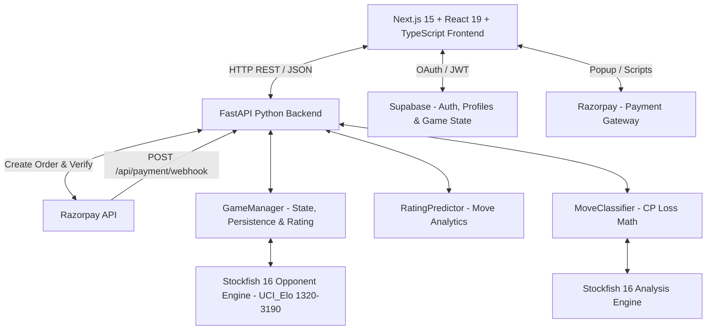
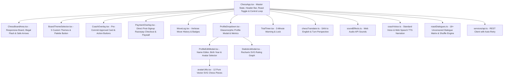
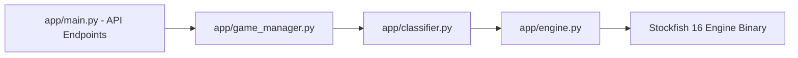
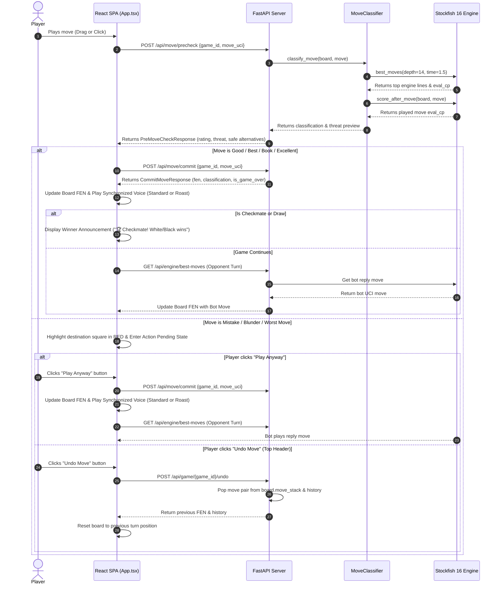
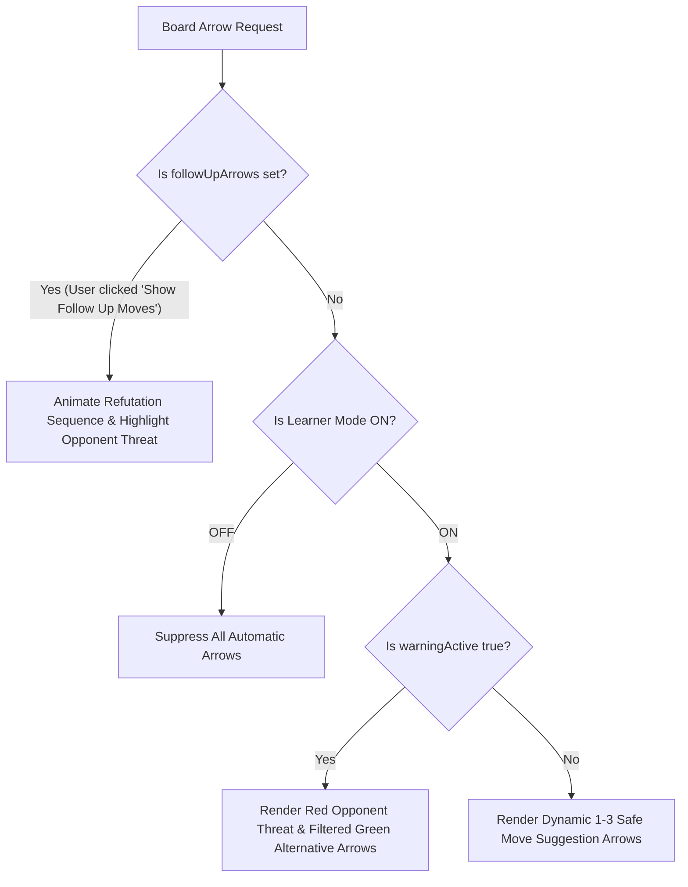
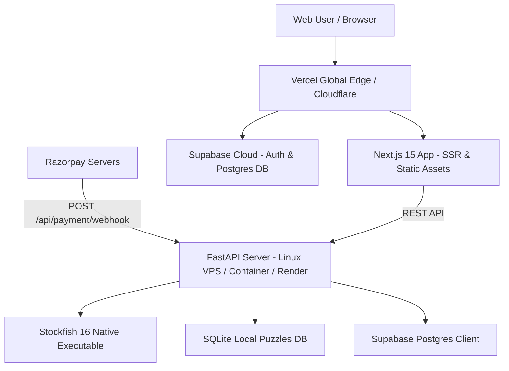

# System Architecture Document

## Project Name: Smart Chess - AI Mistake Coach

---

## 1. High-Level Architecture Overview

**Smart Chess** is structured as a decoupled client-server web application featuring a modern Next.js 15 (React 19) SPA frontend and a high-performance Python FastAPI backend integrated with the Stockfish 16 chess engine and Supabase cloud database.

---

## 2. Component Architecture

### 2.1 Frontend Architecture (Next.js 15 + React 19 + TypeScript)

The frontend is built using Next.js 15 App Router, styled with Tailwind CSS, and powered by `react-chessboard`, `chess.js`, and `recharts`.

- **`ChessApp.tsx`**: Manages master game state (`gameId`, `fen`, `playerColor`, `warningActive`, `history`, `isRobotThinking`, `isConnecting`, `roastModeActive`). Renders the top navigation bar with centralized profile access, side selection, rating slider, learner mode, coach voice, roast mode toggle (with crimson flame theme), and undo controls. Orchestrates dynamic 1–3 green safe arrows (`cp_loss <= 40`) and suppresses arrows on blundered squares.
- **`ProfileDropdown.tsx`**: A dark glassmorphic (`#111`) modal displaying the player's avatar, name, and a 3-column key metrics grid: **Performance Rating**, **Win Rate** (dynamic from finished games), and **Total Games** (with active/finished breakdown). Below the metrics, it lists the top 7 played games with interactive mini `<Chessboard>` thumbnails to click and continue matches. Features a dedicated "View Analytics" action button.
- **`ProfileEditModal.tsx`**: Full-featured profile editor allowing players to update their display name, edit their 4-digit Birth Year, upload custom photos (auto-compressed on client to base64 JPEG under 256px), or select from 12 vector chess piece avatars.
- **`avatarUtils.tsx`**: Contains 12 pure SVG vector chess piece icons (`wP`, `bP`, `wN`, `bN`, `wB`, `bB`, `wR`, `bR`, `wQ`, `bQ`, `wK`, `bK`). Replaced canvas-drawn Unicode emojis to ensure crisp, glitch-free rendering on Windows and all high-DPI displays.
- **`roastDialogues.ts`**: High-performance 18+ savage commentary matrix containing 10+ event categories (Major Blunders, Mistakes, Inaccuracies, Good/Best Moves, Pre-Move Warnings, Undo Moves, Checkmates, Stalemate, Slow Play). Operates a non-repeating shuffle buffer ensuring no duplicate voice lines until the category pool is fully cycled.
- **`BoardThemeSelector.tsx`**: Theme palette selector located beside the white rook at bottom-left of the chessboard (`-left-12 bottom-0`). Supports Classic Wood, Midnight Blue, Emerald Green, Coral, and Obsidian with localStorage persistence.
- **`StatisticsModal.tsx`**: Interactive performance modal powered by **Recharts (^3.10.1)**. Features pure vector SVG rendering, responsive auto-fitting (`<ResponsiveContainer>`), interactive hover tooltips, and dynamic win rate and game outcome breakdowns.
- **`AuthForm.tsx`**: Handles Google OAuth and Email/Password authentication via Supabase. Collects a clean 4-digit Birth Year during signup for age verification without intrusive deterrence labels. Automatically triggers the payment checkout immediately upon account creation.
- **`PaymentOverlay.tsx`**: Triggers Razorpay window. Direct seamless entry on account creation with redundant test-mode buttons removed. On successful payment or webhook confirmation, updates `is_premium` globally. Overlays use cinematic heavy background blur (`backdrop-blur-xl bg-black/90`).
- **`ChessBoardArea.tsx`**: Renders the responsive chessboard grid (`85vh`), handles drag-and-drop & click-to-move input, renders legal destination dots, visual engine arrows (1–3 non-blunder safe hints), orange-red flash on illegal/pinned moves (`illegalFlashSquare`), and solid red square highlights (`badMoveSquare`) on mistakes.
- **`CoachOverlay.tsx`**: Renders the pre-commit approval card over the board with 3 standard buttons: 💡 **Hint Box**, ▶️ **Play Anyway**, and 🛡️ **Show Follow Up Moves**.
- **`coachVoice.ts`**: Dual narration layer supporting both standard supportive commentary and savage 18+ Roast Mode via the Web Speech API. Synchronized 100% with the committed classification badge in `commitAndFinalize`.
- **`soundEffects.ts`**: Web Audio API synthesizer for classic wooden piece movement/capture sounds (`playMoveSoundForUci()`).
- **`chessTranslator.ts`**: Converts SAN notation (e.g. `Nf3`, `exd5`) into natural English with automatic turn-perspective flipping for opponent reply threats.
- **`useSession.ts`**: Implements multi-tier profile persistence (Supabase Auth user metadata + `public.profiles` table upsert + synchronous `localStorage` caching) ensuring zero profile resets on page refresh. Special bypass handling for developer/admin accounts (`janhavikolekar280@gmail.com`).

---

### 2.1b Authentication, Trial & Payments Architecture

The application relies on a combination of Supabase and Razorpay to gate gameplay, utilizing a soft-to-hard paywall model.

1. **3-Minute Free Trial**: Upon starting a game as a guest, unauthenticated or non-premium users trigger a local 3-minute countdown. A warning warns them that progress will be lost. Once 3 minutes elapse, the board locks and resets.
2. **Account Creation & Birth Year**: Users register via Email/Password or Google OAuth (`AuthForm.tsx`). A clean 4-digit Birth Year field is collected and stored in `public.profiles.birth_year`, used as an age gate for Roast Mode (18+) without discouraging player signups.
3. **Immediate Post-Signup Checkout**: Immediately following account creation, the app smoothly transitions the user directly to the Razorpay checkout overlay (`PaymentOverlay.tsx`) without intermediate roadblocks.
4. **Automated Razorpay Webhook Fulfillment**:
   - Order creation (`/api/payment/create-order`) passes the user ID in Razorpay `notes.user_id` and `receipt`.
   - In addition to synchronous client-side verification (`/api/payment/verify`), the backend provides an asynchronous webhook endpoint (`POST /api/payment/webhook`).
   - The webhook validates incoming payload signatures using HMAC SHA-256 (`x-razorpay-signature`) with `RAZORPAY_WEBHOOK_SECRET`.
   - On `payment.captured` or `order.paid` events, it automatically updates `is_premium = True` in Supabase `profiles` even if the client browser disconnects or closes prematurely.

---

### 2.2 Backend Architecture (FastAPI + Stockfish 16)

The backend is built with FastAPI (Uvicorn ASGI server) for high concurrency and asynchronous process management.

- **`app/main.py`**: Exposes REST endpoints for game lifecycle (`/api/game/new`, `/api/game/{id}/state`, `/api/game/{id}/undo`), move precheck (`/api/move/precheck`), move commit (`/api/move/commit`), best engine moves (`/api/engine/best-moves`), Razorpay orders & verification (`/api/payment/create-order`, `/api/payment/verify`), and webhook event ingestion (`/api/payment/webhook`).
- **`app/engine.py`**: Spawns and manages the Stockfish 16 subprocess via `python-chess`. Runs multi-pv centipawn evaluation at depth 14 with a **1.5-second time cap** (`Limit(depth=14, time=1.5)`). Pre-validates `board.status() == STATUS_VALID` in `_safe_analyse` to prevent Stockfish process crashes on corrupted FEN states.
- **`app/classifier.py`**: Implements opening book lookup and centipawn loss calculations ($\text{CP Loss} = \text{Best Eval} - \text{Played Eval}$) to categorize moves according to updated thresholds:
  - **Good**: $\text{CP Loss} \le 40$
  - **Inaccuracy**: $41 \le \text{CP Loss} \le 90$
  - **Mistake**: $91 \le \text{CP Loss} \le 180$
  - **Blunder**: $181 \le \text{CP Loss} \le 350$
  - **Worst Move**: $\text{CP Loss} > 350$
  Filters alternative recommendations to ensure only moves with $\text{CP Loss} \le 40$ are delivered as safe suggestions.
- **`app/game_manager.py`**: Handles game session logic. Responsible for interfacing with the database to persist `Game` objects (FEN, move history) allowing users to resume half-played games. Automatically removes 0-move empty game records.
- **`app/analytics.py`**: Implements the rating prediction algorithm. Analyzes a player's move history, calculates average centipawn loss (ACPL) compared to Stockfish best moves, and updates their "Tactical Performance Rating" tier (e.g. Master +5, Beginner -15).

---

## 3. Data Flow & Pre-Commit Approval Lifecycle

### 3.1 Player Move Lifecycle Sequence

---

## 4. Arrow & Learner Mode Rules

### 4.1 Dynamic 1–3 Safe Green Arrows Algorithm
To eliminate contradictory engine recommendations (where a suggested move would trigger a blunder or mistake warning), the system applies strict candidate filtering:
1. **Engine Candidate Evaluation**: When evaluating hints (`/api/engine/best-moves/{game_id}`), Stockfish evaluates the top 5 legal candidate lines.
2. **Safe Move Filtration (`cp_loss <= 40`)**: Each candidate is evaluated against the position's top engine score:
   $$\text{CP Loss} = \text{Top Engine Eval} - \text{Candidate Eval}$$
   Only candidate moves with $\text{CP Loss} \le 40$ are certified as **Safe Moves**.
3. **Adaptive Count (1 to 3 Arrows)**:
   - If the position only has 1 sound move (e.g., forced evasion or strict best move), **1 arrow** is displayed.
   - If 2 or 3 distinct moves maintain the advantage/equality ($\text{CP Loss} \le 40$), **2 or 3 arrows** are displayed simultaneously.
4. **Self-Blunder Suppression**: During a pre-move pending warning (`warningActive == true`), the attempted blunder/mistake is strictly excluded so the board never points an arrow at the user's erroneous move.

---

## 5. API Specification & Interface Contracts

### 5.1 `POST /api/game/new`
- **Request Body**: `{ "starting_fen": "rnbqkbnr/..." }` (Optional)
- **Response**: `GameStateResponse` (`game_id`, `fen`, `turn`, `move_history`)

### 5.2 `POST /api/move/precheck`
- **Request Body**: `{ "game_id": "uuid", "move_uci": "e2e4" }`
- **Response**: `PreMoveCheckResponse` (`label`, `cp_loss`, `top_alternatives`, `refutation_sequence`, `threat_preview`, `is_box_tier`)

### 5.3 `POST /api/move/commit`
- **Request Body**: `{ "game_id": "uuid", "move_uci": "e2e4" }`
- **Response**: `CommitMoveResponse` (`fen`, `san`, `classification`, `is_game_over`, `result`)

### 5.4 `POST /api/game/{game_id}/undo`
- **Response**: `GameStateResponse` (pops last turn pair from move stack and returns updated FEN and history).

### 5.5 `GET /api/game/resume`
- **Query Parameter**: `user_id=uuid`
- **Response**: `GameStateResponse` (fetches the latest active game session for the authenticated user from the database).

### 5.6 `GET /api/engine/best-moves/{game_id}`
- **Parameters**: `game_id` (path), `n=3` (query)
- **Response**: `{ "best_moves": [...] }` (evaluates top 5 candidate lines and returns up to 3 non-blunder moves where `cp_loss <= 40`).

### 5.7 `POST /api/payment/create-order`
- **Request Body**: `{ "user_id": "uuid" }`
- **Response**: `{ "order_id": "order_...", "amount": 100, "currency": "INR" }`
- **Internal**: Sets `notes: {"user_id": user_id}` and `receipt: user_id` for downstream webhook attribution.

### 5.8 `POST /api/payment/verify`
- **Request Body**: `{ "razorpay_order_id": "...", "razorpay_payment_id": "...", "razorpay_signature": "...", "user_id": "uuid" }`
- **Response**: `{ "status": "success" }`
- **Internal**: Validates cryptographic signature using the Razorpay utility and marks `is_premium = True` in Supabase `profiles`.

### 5.9 `POST /api/payment/webhook`
- **Headers**: `X-Razorpay-Signature: <hex_hmac_sha256>`
- **Payload**: Raw Razorpay webhook JSON payload (`payment.captured`, `order.paid`).
- **Response**: `{ "status": "ok" }`
- **Security**: Verifies webhook signature against `RAZORPAY_WEBHOOK_SECRET`. Extracts `user_id` from notes/receipt/description and sets `is_premium = True` asynchronously.

### 5.10 `GET /api/user/profile`
- **Query Parameter**: `user_id=uuid`
- **Response**: `{ "predicted_rating": 1450, "total_games": 12, "name": "...", "avatar_url": "...", "birth_year": 1998 }`

### 5.11 `GET /api/user/games`
- **Query Parameter**: `user_id=uuid`
- **Response**: `{ "games": [...] }` (fetches up to 50 match records; automatically filters out 0-move unplayed active games so only genuine played games are returned).

### 5.12 `POST /api/puzzles/start` & `POST /api/puzzles/attempt`
- **Data Store**: Local SQLite database (`puzzles2.db`) managed via `PuzzleManager`. Completely decoupled from match win rates and Supabase games table.
- **Request/Response**: Starts puzzle sessions by difficulty tier (1-5) and evaluates player tactical move attempts against benchmark solutions.

---

## 6. Match Continuation & Win Rate Business Rules

1. **Played Game Threshold**:
   - Only games where **at least 1 move was made** (pawn or piece moved, `move_history.length > 0`) are retained as continuable active games.
   - 0-move untouched starting-board sessions are automatically pruned upon new game creation and filtered out from the Recent Games list.
2. **Recent Games Cap**:
   - The Player Profile dropdown displays up to the **top 7 recent played games** (`slice(0, 7)`), allowing users to click and resume any active game cleanly.
3. **Win Rate Isolation**:
   - Win Rate = $\frac{\text{Wins}}{\text{Wins} + \text{Losses} + \text{Draws}} \times 100$.
   - Active/in-progress games do not count toward completed outcomes. When no completed games exist, the UI gracefully displays `0%` with subtitle `No finished games`.
   - Puzzles never affect match win rate or rating trajectory charts.

---

## 7. Deployment Architecture

- **Frontend**: Hosted on Vercel or equivalent Next.js edge platform for sub-second global delivery.
- **Backend API**: Hosted on a dedicated Linux VPS / Docker container (Render / Railway / AWS / DigitalOcean) providing steady multi-core CPU access for Stockfish 16 UCI process threads.
- **Database**: Supabase cloud managed PostgreSQL with Row Level Security (RLS) policies.
- **Webhooks**: Direct HTTPS connection between Razorpay servers and Backend for resilient payment settlement.

---

## 8. Roast Mode (18+) System Architecture

### 8.1 Overview & Design Principles
Roast Mode transforms the chess coach into an aggressive, sarcastic, uncensored 18+ adversary. It operates on five core principles:
1. **Short & Punchy Delivery**: Every dialogue line is between 3 to 8 words for rapid delivery.
2. **Zero Emojis & Raw Realism**: Employs authentic, unfiltered language without playful emojis.
3. **Non-Repeating Shuffle Buffer**: Tracks played dialogues in an in-memory session buffer; no line repeats until all lines in that category pool have fired.
4. **Context-Driven Categories**: Triggered by specific move outcomes:
   - `MAJOR_BLUNDERS` ($\text{CP Loss} > 350$ or hanging Queen)
   - `MISTAKES` ($91 \le \text{CP Loss} \le 180$)
   - `INACCURACIES` ($41 \le \text{CP Loss} \le 90$)
   - `GOOD_MOVES` ($\text{CP Loss} \le 40$)
   - `PRE_MOVE_WARNINGS` (Attempting a blunder with action pending)
   - `UNDO_MOVE` (Player clicks Undo)
   - `CHECKMATE_ROBOT_WINS` / `CHECKMATE_PLAYER_WINS` / `STALEMATE`
   - `SLOW_PLAY` (Player idles > 45 seconds without moving)
5. **Age Gate Compliance**: Player profile checks `birth_year` to ensure player is 18+. Users under 18 receive an advisory notice, keeping default onboarding clean and non-deterrent.

