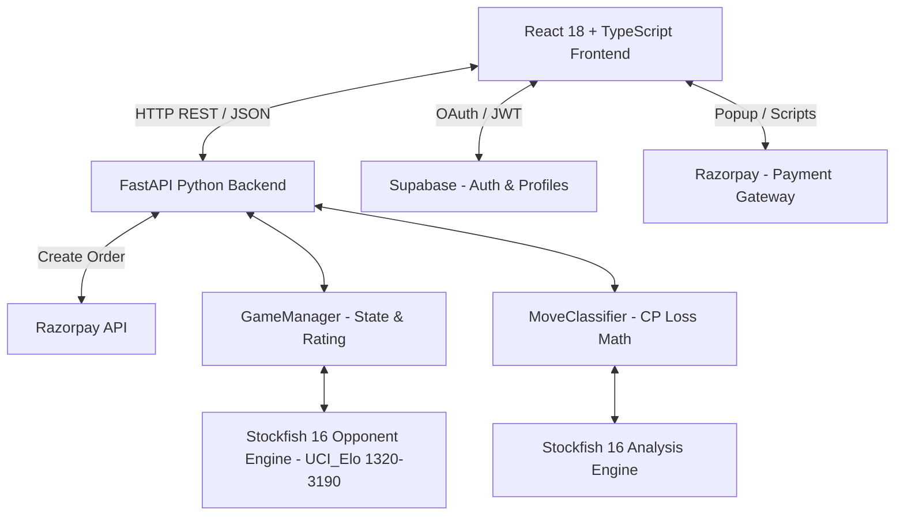
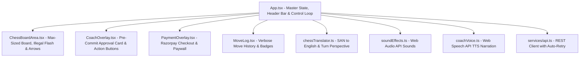
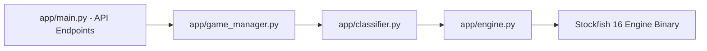
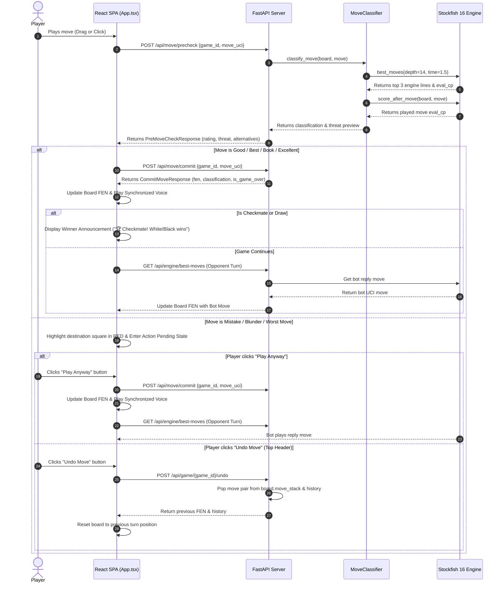
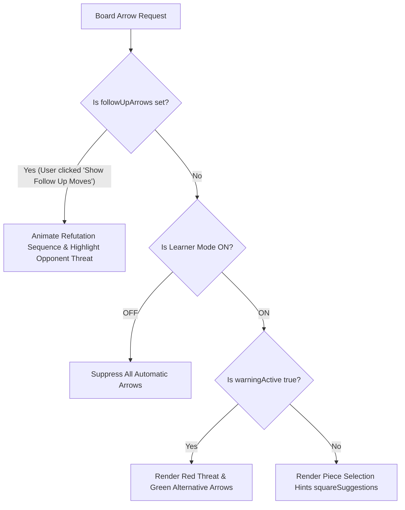
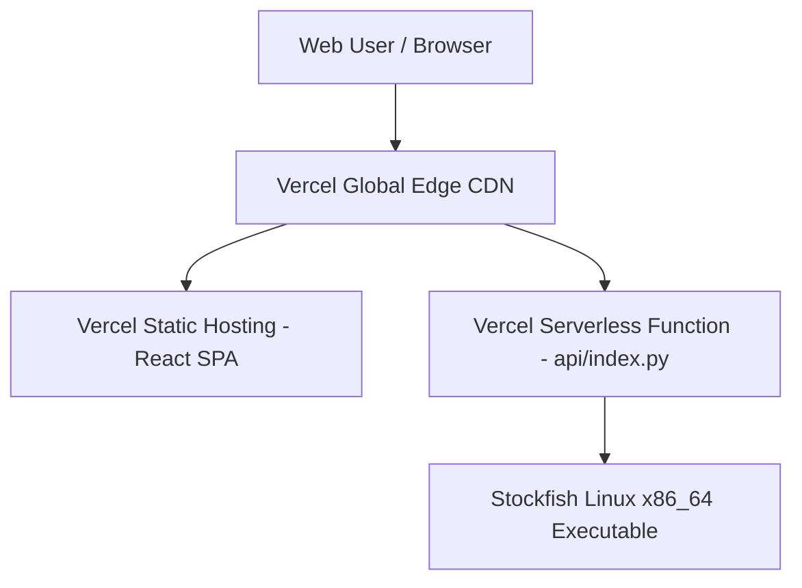

# System Architecture Document

## Project Name: Smart Chess - AI Mistake Coach

---

## 1. High-Level Architecture Overview

**Smart Chess** is structured as a decoupled client-server web application featuring a modern React SPA frontend and a high-performance Python FastAPI backend integrated with the Stockfish 16 chess engine.

---

## 2. Component Architecture

### 2.1 Frontend Architecture (React 18 + TypeScript)

The frontend is a single-page application built using Vite, styled with Tailwind CSS, and powered by `react-chessboard` and `chess.js`.

- **`App.tsx`**: Manages master game state (`gameId`, `fen`, `playerColor`, `warningActive`, `history`, `isRobotThinking`, `isConnecting`). Renders the top navigation bar (`Game Mode`, `Side Selection`, `Restart Game`, `Learner Mode: ON/OFF`, `Coach Voice: ON/OFF`, `Undo Move`), handles startup auto-retry (3 attempts, 2s delay), and executes pre-commit approval flow. Integrates with `useSession` to trigger the paywall (`PaymentOverlay.tsx`) if a non-premium user tries to play.
- **`ChessBoardArea.tsx`**: Renders the max-sized responsive chessboard grid (`85vh`), handles drag-and-drop & click-to-move input, renders legal destination dots, visual engine arrows, orange-red flash on illegal/pinned moves (`illegalFlashSquare`), and solid red square highlights (`badMoveSquare`) on mistakes.
- **`CoachOverlay.tsx`**: Renders the pre-commit approval card over the board with 3 standard buttons: 💡 **Hint Box**, ▶️ **Play Anyway**, and 🛡️ **Show Follow Up Moves**.
- **`PaymentOverlay.tsx`**: Renders the paywall screen. Handles the frontend logic for initiating a Razorpay order via the backend, displaying the Razorpay checkout script, and directly updating the user's `is_premium` status in Supabase upon successful payment.
- **`coachVoice.ts`**: Web Speech API Text-to-Speech narration layer. Audio lines are 100% synchronized with the committed classification badge in `commitAndFinalize`.
- **`soundEffects.ts`**: Web Audio API synthesizer for classic wooden piece movement/capture sounds (`playMoveSoundForUci()`).
- **`chessTranslator.ts`**: Converts SAN notation (e.g. `Nf3`, `exd5`) into natural English with automatic turn-perspective flipping for opponent reply threats.

---

### 2.1b Authentication & Payments Architecture

The application relies on a combination of Supabase and Razorpay to gate gameplay behind a premium paywall.

1. **Authentication**: Users log in via Google OAuth directly from the frontend (`AuthForm.tsx`). Supabase manages the session via JWTs and creates a corresponding record in the `profiles` table via a database trigger.
2. **Payments (Order Creation)**: When a user clicks to pay, the backend (`/api/payment/create-order`) securely communicates with Razorpay using secret keys to generate an `order_id`.
3. **Payments (Checkout & Fulfillment)**: The frontend consumes the `order_id` to render the Razorpay popup. Upon a successful transaction, the frontend directly sets `is_premium = true` in Supabase to instantly unlock the game.

---

### 2.2 Backend Architecture (FastAPI + Stockfish 16)

The backend is built with FastAPI (Uvicorn ASGI server) for high concurrency and asynchronous process management.

- **`app/main.py`**: Exposes REST endpoints for game lifecycle (`/api/game/new`, `/api/game/{id}/state`, `/api/game/{id}/undo`), move precheck (`/api/move/precheck`), move commit (`/api/move/commit`), and best engine moves (`/api/engine/best-moves`).
- **`app/engine.py`**: Spawns and manages the Stockfish 16 subprocess via `python-chess`. Runs multi-pv centipawn evaluation at depth 14 with a **1.5-second time cap** (`Limit(depth=14, time=1.5)`). Pre-validates `board.status() == STATUS_VALID` in `_safe_analyse` to prevent Stockfish process crashes on corrupted FEN states.
- **`app/classifier.py`**: Implements opening book lookup and centipawn loss calculations ($\text{CP Loss} = \text{Best Eval} - \text{Played Eval}$) to categorize moves into *Book*, *Brilliant*, *Best*, *Excellent*, *Good*, *Inaccuracy*, *Mistake*, *Blunder*, and *Worst Move*.
- **`app/game_manager.py`**: Stores in-memory game sessions (`Game` objects), board move stacks (`chess.Board`), move histories, and executes full-stack move popping (`undo_last_move`).

---

## 3. Data Flow & Pre-Commit Approval Lifecycle

### 3.1 Player Move Lifecycle Sequence

---

## 4. Arrow & Learner Mode Rules

---

## 5. API Specification & Interface Contracts

### 5.1 `POST /api/game/new`
- **Request Body**: `{ "starting_fen": "rnbqkbnr/..." }` (Optional)
- **Response**: `GameStateResponse` (`game_id`, `fen`, `turn`, `move_history`)

### 5.2 `POST /api/move/precheck`
- **Request Body**: `{ "game_id": "uuid", "move_uci": "e2e4" }`
- **Response**: `PreMoveCheckResponse` (`label`, `cp_loss`, `top_alternatives`, `refutation_sequence`, `threat_preview`, `is_box_tier`)

### 5.3 `POST /api/move/commit`
- **Request Body**: `{ "game_id": "uuid", "move_uci": "e2e4" }`
- **Response**: `CommitMoveResponse` (`fen`, `san`, `classification`, `is_game_over`, `result`)

### 5.4 `POST /api/game/{game_id}/undo`
- **Response**: `GameStateResponse` (pops last turn pair from move stack and returns updated FEN and history).

---

## 6. Deployment Architecture (Vercel Serverless)

- **Frontend**: Hosted on Vercel Static CDN for instant global delivery.
- **Backend API**: Packaged as a Python serverless function (`api/index.py`) powered by `vercel.json`.
- **Stockfish Binary**: Executable in `Backend/bin/stockfish` for Linux x86_64 Lambda execution.
