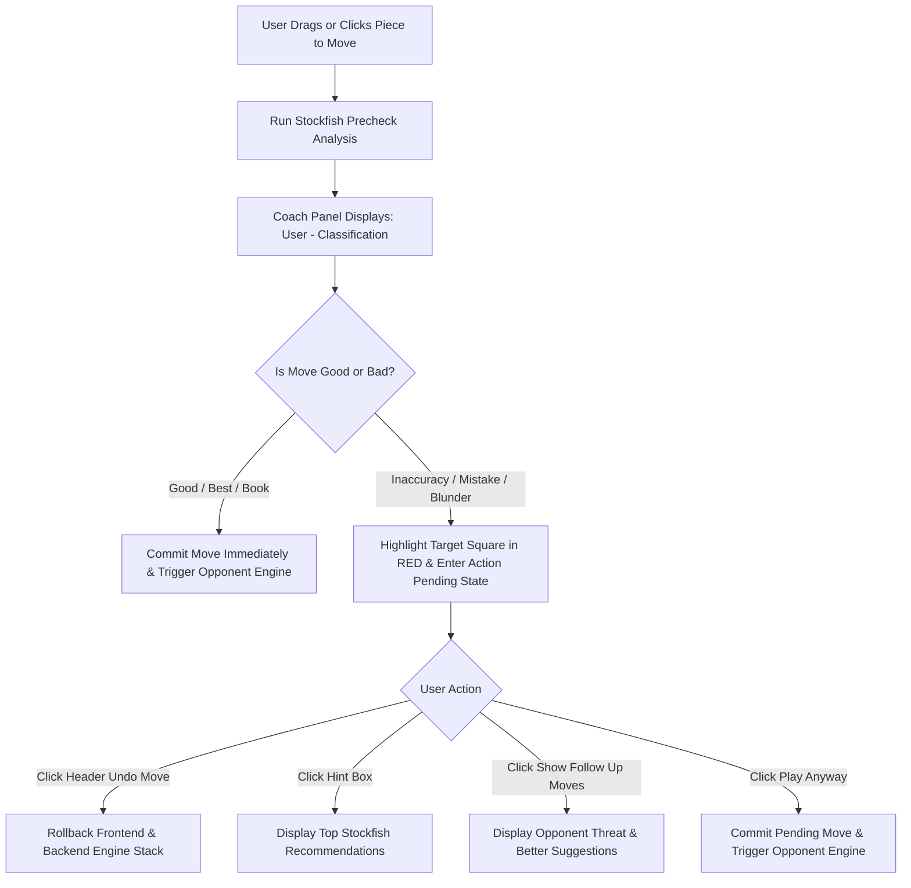

# Product Requirements Document (PRD)

## Project Name: Smart Chess - AI Mistake Coach

---

## 1. Executive Summary & Vision

**Smart Chess** is an interactive, real-time AI-assisted chess application designed to bridge the gap between playing chess and actively improving your game. Unlike traditional chess platforms that only analyze your game after it is finished, Smart Chess acts as a live **AI Mistake Coach**. It evaluates moves instantly using Stockfish 16, provides human-perspective feedback (e.g., *User - Mistake*, *User - Inaccuracy*, *User - Best*), highlights problematic moves in red, and offers an interactive pre-commit approval flow (*Play Anyway*, *Hint Box*, *Show Follow Up Moves*) so learners can analyze threats or retry moves before the bot responds.

---

## 2. Target Audience

1. **Beginner to Intermediate Chess Players (Rating 400 - 1600)**:
   - Players who want to understand *why* a move was bad right when they play it, rather than waiting for post-game analysis.
   - Learners who benefit from visual arrows, square highlights, and plain-English move translations (e.g., *White Pawn to e4*).

2. **Self-Paced Chess Students & Coaches**:
   - Students looking for an interactive sandbox where they can retry moves, explore Stockfish-recommended lines, and see immediate punishment paths (*Show Follow Up Moves*).

3. **Casual Players Seeking Learner Assistance**:
   - Players who prefer an option to toggle **Learner Mode** on or off depending on whether they want visual assist arrows and piece suggestions.

---

## 3. Core Features & Functional Requirements

### 3.1 Interactive Board & Max-Sized Responsive Sizing
- **Max-Sized 8x8 Chessboard**: Scales up to `85vh` (up to `88vh` on 2K/4K displays), eliminating empty margin dead space.
- **Visual Styling**: Built with modern dark aesthetic (`#4a4a4a` / `#8a8a8a` square pattern), crisp bold black SVG coordinate labels (`a-h`, `1-8`), and smooth 200ms piece movement animations.
- **Dual Control Options**: Supports both **Drag-and-Drop** piece dragging and **Click-to-Move** (click source piece $\rightarrow$ green target dots $\rightarrow$ click destination).
- **Side Selection**: Toggle between **⚪ White** and **⚫ Black** side; board flips automatically and Stockfish engine plays the opposing color.
- **Clean Header Navigation Bar**: Top navigation bar displaying **You Vs Robot**, **Side Selection**, **Restart Game**, **Learner Mode: ON/OFF**, and **Undo Move**.

### 3.2 Real-Time Stockfish 16 Engine Integration
- **Engine Analysis**: Backend communicates with Stockfish 16 (or Stockfish JS fallback) at depth 14+ for millisecond centipawn evaluation (`score_cp`) and mate calculations.
- **Centipawn Loss Calculation**:
  $$\text{Centipawn Loss} = \text{Best Engine Move Eval} - \text{Played Move Eval}$$

### 3.3 Move Classification System
Every move played by the user is evaluated against Stockfish thresholds and labeled from the **User's Perspective**:

| Classification | Centipawn Loss Range / Criteria | UI Representation |
| :--- | :--- | :--- |
| **Book** | Known opening theory (Plies 1-3) | Neutral Badge |
| **Brilliant** | Tactical sacrifice yielding high evaluation | Bright Cyan Badge |
| **Best** | Matches Stockfish's top move ($0$ CP loss) | Green Badge |
| **Excellent** | $0 \le \text{CP Loss} \le 10$ | Green Badge |
| **Good** | $11 \le \text{CP Loss} \le 25$ | Soft Green Badge |
| **Inaccuracy** | $26 \le \text{CP Loss} \le 60$ | Yellow Badge + Red Destination Square |
| **Mistake** | $61 \le \text{CP Loss} \le 150$ | Orange Badge + Red Destination Square |
| **Blunder** | $> 150$ CP Loss | Red Badge + Red Destination Square |
| **Miss** | Overlooked forced tactical win / mate | Red Badge + Red Destination Square |

### 3.4 Coach Feedback & Red Square Highlight
- **Coach Feedback Header**: Displays **`User - [Rating]`** (e.g., *User - Mistake*, *User - Excellent*) immediately after a move attempt.
- **Red Move Square Highlight**: When a move is classified as an *Inaccuracy*, *Mistake*, *Blunder*, or *Miss*, the destination square of the move is highlighted in **solid red** on the board.

### 3.5 Pre-Commit Approval & Move Controls
- **Good / Best / Book Moves**: Commit immediately, updating the board FEN and triggering the opponent response seamlessly.
- **Inaccurate / Mistake / Blunder Moves**: Pause in an **`Action Pending`** state with a red square highlight until the user decides.
- **Move Controls (3 Permanent Buttons)**:
  1. 💡 **Hint Box**: Displays recommended top Stockfish alternative moves (e.g. *White Knight to f3 [+1.2]*). Clicking any recommendation auto-plays it.
  2. ▶️ **Play Anyway**: Finalizes the pending move, commits to the backend engine, and triggers opponent response.
  3. **Show Follow Up Moves**: Displays both the opponent's strongest reply threat (e.g. *They can play Black Queen to d4*) AND clickable better move recommendations.
- **Top Header Undo Button**: **`Undo Move`** (located in the top bar beside Learner Mode) executes a full-stack rollback (frontend + backend engine stack) to retry your move.

### 3.6 Formatted Move Log
- **Human-Readable Moves**: Displays move history translated into verbose English with side colors (e.g. `1. White Pawn to e4 [BOOK] Black Pawn to d5 [BOOK]`).

### 3.7 Learner Mode Toggle
- **Learner Mode: ON**: Displays visual engine recommendation arrows on the board.
- **Learner Mode: OFF**: Completely disables all board arrows for clean, competitive play.

---

## 4. User Experience & Interaction Flow



---

## 5. Technical Stack & System Architecture

### 5.1 Technology Stack

- **Frontend**:
  - Framework: **React 18** + **TypeScript**
  - Build Tool: **Vite**
  - Styling: **Tailwind CSS** (Dark Mode Theme) + Vanilla CSS Overrides
  - Chess Board Render: **`react-chessboard`**
  - Game Logic Utilities: **`chess.js`**
  - Icons: **Lucide React**

- **Backend**:
  - Framework: **FastAPI** (Python 3.10+)
  - Server: **Uvicorn** (Asynchronous ASGI)
  - Engine Wrapper: **`python-chess`**
  - Chess Engine: **Stockfish 16** (Linux x86_64 / Windows binary)

### 5.2 Folder Structure

```
Smart_Chess/
├── PRD.md
├── ARCHITECTURE.md
├── Backend/
│   ├── app/
│   │   ├── main.py            # FastAPI endpoints (/api/game, /api/move/commit, /api/game/undo)
│   │   ├── engine.py          # Stockfish process wrapper & analysis
│   │   ├── classifier.py      # Move classification & CP loss math
│   │   ├── game_manager.py    # Game state memory, move history, & stack undo
│   │   └── schemas.py         # Pydantic request/response schemas
│   └── requirements.txt
├── Frontend/
│   ├── src/
│   │   ├── components/
│   │   │   ├── ChessBoardArea.tsx  # Max-sized board rendering & red square highlight
│   │   │   ├── CoachPanel.tsx      # Coach feedback & 3 action buttons (Hint, Play Anyway, Show Follow Up Moves)
│   │   │   ├── MoveLog.tsx         # Verbose English move log
│   │   │   └── SpeechBubble.tsx    # Coach feedback bubble
│   │   ├── services/
│   │   │   └── api.ts              # REST API client
│   │   ├── utils/
│   │   │   └── chessTranslator.ts  # SAN to verbose English translator
│   │   ├── App.tsx                 # Master application state, header controls & control loop
│   │   └── index.css               # Global CSS & SVG board overrides
│   ├── package.json
│   └── vite.config.ts
└── vercel.json                     # Vercel Serverless deployment config
```

---

## 6. Deployment Strategy (Vercel Ready)

The project is structured for single-repo Vercel deployment:
- **Frontend**: Deployed as Vite static SPA on Vercel CDN.
- **Backend**: Deployed as a Python Serverless Function (`api/index.py`) using `vercel.json` with a Linux x86_64 Stockfish binary or JS Stockfish fallback.
